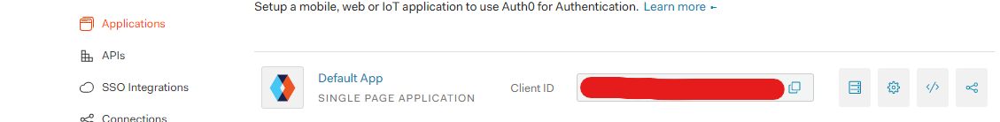

# jwt-tutorial-impl

i tried jwt to learn how oauth also work

## reference

Every screenshot of the file is every step/commit in this repo to learn easily.

https://auth0.com/blog/authentication-in-golang/

## run

```
$ AUTH0SECRET="" AUTH0AUDIENCE="" AUTH0DOMAIN="" go run .
```

fill the empty string above based on the values below.
<hr>

**AUTH0SECRET**


<hr>

**AUTH0AUDIENCE**

also called as *AUTH0_API_AUDIENCE*


<hr>

**AUTH0_CALLBACK_URL**


<hr>

**AUTH0DOMAIN**

also called as *AUTH0_DOMAIN*


<hr>

**AUTH0_CLIENT_ID**


<hr>

## license

MIT
